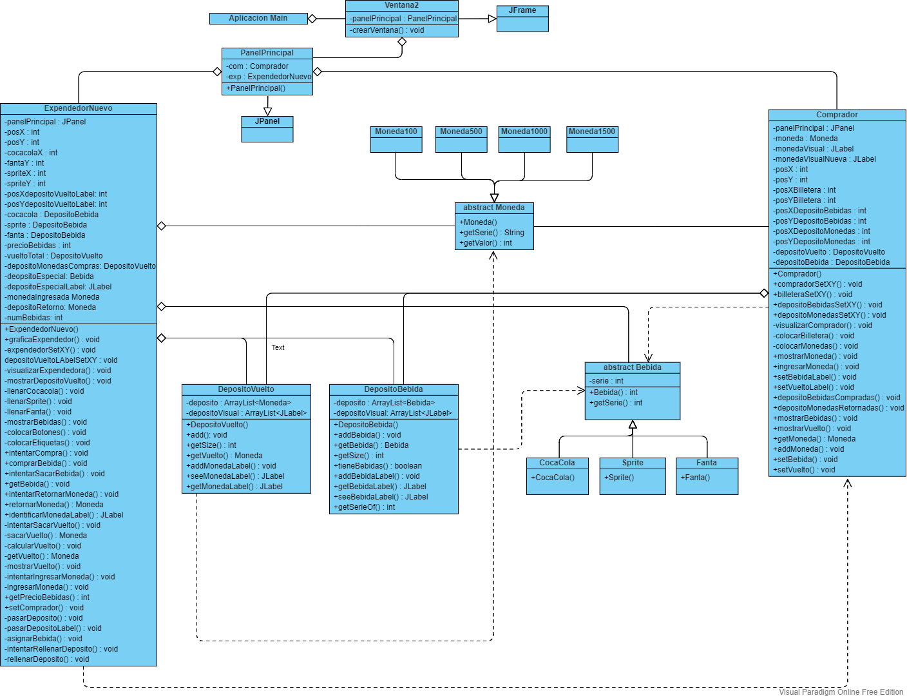

# Tarea N°3 programacion II

Repositorio Tareas N°3 de la asignatura Programacion 2 S2-22 de la carrera Ingenieria Civil Informatica de la Universidad de Concepcion.

>Fecha de entrega **13 de Noviembre hasta las 23:59.**

<!-- agregar fotos del UML -->
## Enunciado

Esta tarea es un incremento a lo realizado en la tarea 2, que incluyó un Expendedor de Bebidas y un Comprador. El
incremento consiste en agregarle la perspectiva gráfica 2D, logrando más parecido con la realidad. La idea es que, usando
eventos provocados por el mouse, sea posible mostrar como los objetos de la aplicación se mueven. Para lograr la
perspectiva gráfica, se le agregará a cada clase de objeto una nueva capacidad que le permitirá auto dibujarse: paint, Para
que esta capacidad pueda operar en una ventana gráfica se deben agregar como propiedades un par de enteros para las
coordenadas (x, y) de posición del objeto dentro de la ventana, las podrá ser inicializadas en el método constructor y sus
parámetros. Debes imaginar que el expendedor tiene un vidrio que permite ver los depósitos en su interior y también las
bebidas y monedas que contienen.

Para lograr la tarea 2, usarás como base el proyecto de interfaz GUI visto du en clases y el código de la tarea 2, partiendo
de la manera que se te sugiere más adelante.

Para la tarea, el método “main” solo tiene el código para crear una instancia de Ventana, nada más, todo el resto es creado
en una especie de árbol de clases conectadas a partir de Ventana.

Toda la actividad de los objetos será originada por eventos de mouse sobre la clase que extiende JPanel principal. Los
eventos serán enviados al comprador o expendedor, que reaccionarán dependiendo de donde sea el click dentro de ellos.

## Grafico UML

## Autores

- [@PabloSanhueza1](https://github.com/PabloSanhueza1) Pablo Sanhueza Yévenes
- [@TheAmazingLife](https://github.com/TheAmazingLife) Joaquin San Martín Vargas

